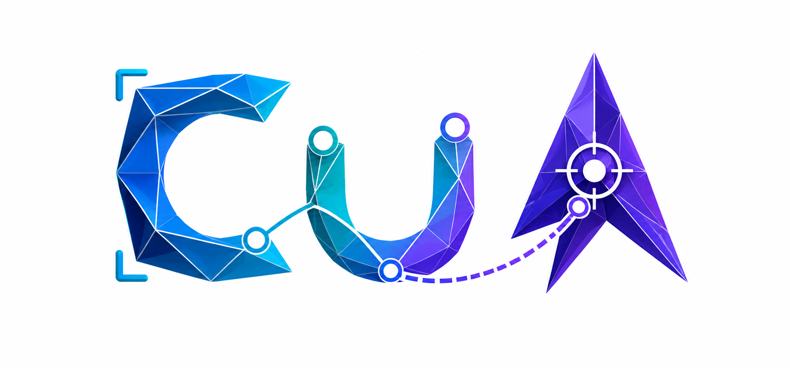

<p align="center">
  
</p>

<p align="center">
  <a href="README.md">English</a> | 简体中文
</p>

# dcc-cua

`dcc-cua` 是基于开源 [CUA SDK](https://github.com/trycua/cua) 的跨平台
Computer Use Automation 运行时和命令行工具，支持 Windows、Linux 和 macOS。

项目最初来自 `dcc-mcp-core`，现在由独立仓库维护通用的 Host 协议、安全边界和
平台能力。`dcc-mcp-core` 是它的使用方，而不是运行时依赖。发布包内只有一个
`dcc-cua` 可执行文件，不需要额外安装或分发 `cua-driver`。

> 本文帮助中文用户完成安装、Profile 选择和常用控制。完整 CLI 参数、Host IPC
> 方法和协议细节以[英文 README](README.md)为准；命令、字段名和稳定 ID 不翻译。

## 安全契约

- 所有窗口操作必须绑定精确的 PID、窗口 ID 和标题范围，Agent 不能扩大目标。
- 每次修改操作都需要新的 observation ID；操作后必须重新观察并独立验证结果。
- 文本、按键、拖拽和坐标输入都有边界限制，敏感窗口默认拒绝控制。
- Windows 物理 `Escape` 和跨平台 `interrupt_all` 会停止 Host 中的活动连接。
- Windows、Linux 和打包后的 macOS Host 都提供可见控制指示；指示层不会出现在
  Agent 截图中，也不会截获点击。
- Cloudflare 等真人验证、安全确认、账号、购买和下载边界需要可信人工确认授权；
  Profile 只声明路由，不能绕过网站或操作系统的安全策略。

即使 Agent 获得完整访问权限，上述精确窗口、最新观察和可信确认边界仍然有效。
完整访问允许 Agent 在授权窗口中使用点击等输入能力，不代表可以静默处理真人验证。

## 架构与集成边界

主要 crate 的职责如下：

| crate | 职责 |
| --- | --- |
| `dcc-cua-core` | 作用域、观察、策略、会话和 CUA 执行边界 |
| `dcc-cua-host` | 长生命周期、版本化 IPC 和请求路由 |
| `dcc-cua-client` | 供 `dcc-mcp-core` 等调用方复用的 Host 客户端 |
| `dcc-cua-browser` | 精确窗口浏览器绑定、CDP 操作和受限文件传输 |
| `dcc-cua-semantic-profiles` | 应用选择器、语义表面、目标、路由和回退声明 |
| `dcc-cua-indicator` | 控制提示、停止代次和 Windows 物理 Escape 边界 |
| `dcc-cua-cli` | 组合工作区能力的单一命令行入口 |

应用专用适配器位于本工作区之上。DCC 操作应优先使用 Maya、Houdini、Unreal 等
应用的 typed API，再使用 `dcc-cua` 的精确窗口语义或视觉控制。浏览器流程应走
`dcc-cua` 的 `browser_dom` 路由，不要替换成 in-app Browser skill。

## 独立语义 Profile

`dcc-cua-semantic-profiles` 当前内置 `ue`、`maya` 和 `fab`。Profile 是声明式的
路由和词汇契约，不是自动化脚本：它不会启动应用、自动切换回退、执行操作或证明
结果。Core 和 Host 仍负责窗口作用域、观察、授权、输入和验证。

| 字段 | Agent 应如何理解 |
| --- | --- |
| `selectors` | 候选应用、窗口或 URL 身份；对象之间是 OR，对象内部约束是 AND |
| `surfaces[]` | 稳定任务区域，例如 `outliner`、`dialog`、`launcher_download` |
| `targets[]` | 稳定意图词汇；`supported_actions` 是允许列表，不是执行指令 |
| `fallback` | 指向其他 `profile_id`/`surface_id`；切换后必须重新发现、绑定和观察 |
| `settings` | 默认 locale、首选路由、对话框风格和破坏性操作确认策略 |

路由所有权必须明确：

| 路由 | 执行方 |
| --- | --- |
| `accessibility` | Profile CLI；仅在一个最新的真实元素精确匹配时操作 |
| `unreal_typed_api` | Unreal 适配器或 Skill |
| `browser_dom` | 已绑定精确浏览器的适配器 |
| `os_native_dialog` | 平台原生对话框控制路径 |
| `visual_fallback` | `dcc-cua` 的最新精确窗口视觉观察 |

### 多语言规则

Profile 使用 BCP-47 locale 标签维护可见文本别名。所有语言别名都参与匹配，Agent
不需要先猜测 UI 语言；`dcc-cua profiles` 会通过 `supported_locales` 暴露覆盖范围。

- `default_locale` 标记未带 locale 的已有别名。
- `localized_names` 和本地化窗口标题只保存用户可见文本。
- `profile_id`、`surface_id`、`target_id`、role、action 和 automation ID 必须稳定，
  不随语言翻译。
- 匹配会压缩空白并执行 Unicode 小写转换。
- 只包含 `window_title_contains` 和 `names` 的旧 Profile 仍然有效。

Agent 应按以下顺序使用 Profile：

1. 运行 `dcc-cua profiles`，查看 `supported_locales`，再用
   `dcc-cua profile --id ID` 检查候选 Profile。
2. 用 `dcc-cua list --on-screen` 发现真实 PID 和窗口 ID，并绑定精确身份。
3. 选择 surface 和稳定 target ID；本地化名称只用于匹配当前 UI。
4. 根据 surface 的 `route` 分发；`profile --action` 只执行 `accessibility` 路由。
5. 遇到 `fallback` 时重新发现、绑定、观察和验证，不能沿用旧窗口状态。
6. 每次修改后重新观察，并验证业务状态；输入已送达不等于任务成功。

例如，UE 编辑器内 Fab 下载不可用时，`ue/fab/download` 会声明回退到
`fab/launcher_download`。Agent 必须重新绑定 Epic Games Launcher；账号、购买、
Cloudflare 验证和安全确认仍需人工授权。

查看 Profile 不需要启动 DCC：

```powershell
dcc-cua profiles
dcc-cua profile --id maya
dcc-cua profile --profile-file C:\profiles\maya-studio.json
```

发现窗口后，按稳定 target 查询或执行一个 accessibility 操作：

```powershell
dcc-cua list --app maya.exe --on-screen
dcc-cua profile --id maya --pid $pid --window-id $hwnd --surface home --query new_scene
dcc-cua profile --id maya --pid $pid --window-id $hwnd --surface home --query new_scene --action click --activate
```

发布包还包含两个独立 Agent Skill：

- `skills/cua-cli`：CLI 控制循环、验证、安全策略和长任务恢复；
- `skills/cua-profile-authoring`：官方及用户自定义 Profile 的编写规范。

## 常用 CLI

开发环境可用 `cargo run -p dcc-cua-cli --` 替换下面命令中的 `dcc-cua`：

```powershell
dcc-cua manifest
dcc-cua doctor
dcc-cua apps
dcc-cua list --app maya.exe --on-screen
dcc-cua snapshot --pid 4242 --window-id 123456 --output before.png
dcc-cua accessibility --pid 4242 --window-id 123456
dcc-cua click --pid 4242 --window-id 123456 --element-index 12
dcc-cua type --pid 4242 --window-id 123456 --text "hello" --focused
dcc-cua verify --pid 4242 --window-id 123456 --expect-json '[{"window":{"exists":true}}]'
dcc-cua interrupt-all
dcc-cua update --check
```

`manifest` 是供 Core 和独立调用方使用的稳定机器入口，包含平台、协议、能力、端点、
图像传输和推荐启动参数，并明确声明不需要单独 driver。若同一应用有多个窗口，操作时
必须传入 `--pid` 和 `--window-id`。优先使用观察结果中的 `element_token` 或
`element_index`，自绘界面才使用坐标。

单次窗口操作会尝试生成新的操作后截图。如果输入已执行但截图失败，结果会返回
`action_was_executed: true`，调用方不得盲目重试。完整命令和参数见
[CLI 参考](README.md#cli)。

## Host IPC

多步骤 Agent 应复用一个持久 Host 连接，让同一 PID/窗口 ID 保持控制指示、会话和
observation fence：

```powershell
dcc-cua host --stdio
dcc-cua host-ensure
dcc-cua ping
dcc-cua host-call --method list_apps --json '{}'
dcc-cua host-jsonl --output-dir artifacts
```

`dcc-cua-client` 是 `dcc-mcp-core` 的直接嵌入路径：

```rust,no_run
let mut host = dcc_cua_client::HostClient::connect_default("dcc-mcp-core").await?;
let response = host.request("list_windows", serde_json::json!({})).await?;
let stopped = host.interrupt_all().await?;
```

每个连接先执行 `hello`；请求使用 `request_id` 关联响应，图像可通过共享内存或二进制
附件传输。修改请求保持串行，无状态发现请求可做有界并行。Host 不自动重放失败请求；
重启后必须重新打开会话并获取新观察。完整方法、grant、JSONL 和协议限制见
[Host IPC 参考](README.md#host-ipc)。

## 开发门槛

Windows 的 `vx.toml` 固定 MSVC 14.44、Spectre 缓解库和 Windows SDK 环境。
工作区使用 Hakari 统一四个构建目标的依赖 feature，同时保持 target/host 图隔离。

```powershell
vx cargo install cargo-nextest cargo-hakari --locked
vx cargo hakari generate --diff
vx cargo hakari manage-deps --dry-run
pwsh -NoProfile -File scripts/check-rust-layout.ps1
vx cargo fmt --all -- --check
vx cargo nextest run --workspace --all-targets --locked
vx cargo test --workspace --doc --locked
```

可选的真实 GUI E2E：

```powershell
vx cargo nextest run --locked -p dcc-cua-e2e --features gui-e2e --no-run
pwsh -NoProfile -File scripts/run-gui-e2e.ps1 -Binary target/debug/dcc-cua.exe
```

## CI/CD 与发布

CI 在 Windows、Linux 和 macOS 上检查代码布局、格式、工作区测试、锁定 release
构建和真实发布二进制 E2E。发布归档包含单个 `dcc-cua` 可执行文件、assets、Skills、
英文/简体中文 README 以及项目和上游许可证。

发布门槛在产品验收前保持关闭；不要提前设置
`DCC_CUA_RELEASE_READY=true`。Release Please 负责版本和变更日志，不发布 crates。

CUA SDK revision 固定在 `Cargo.toml` 和 `Cargo.lock`。真实截图和输入仍要求当前操作系统
具有原生桌面权限和交互式会话。
