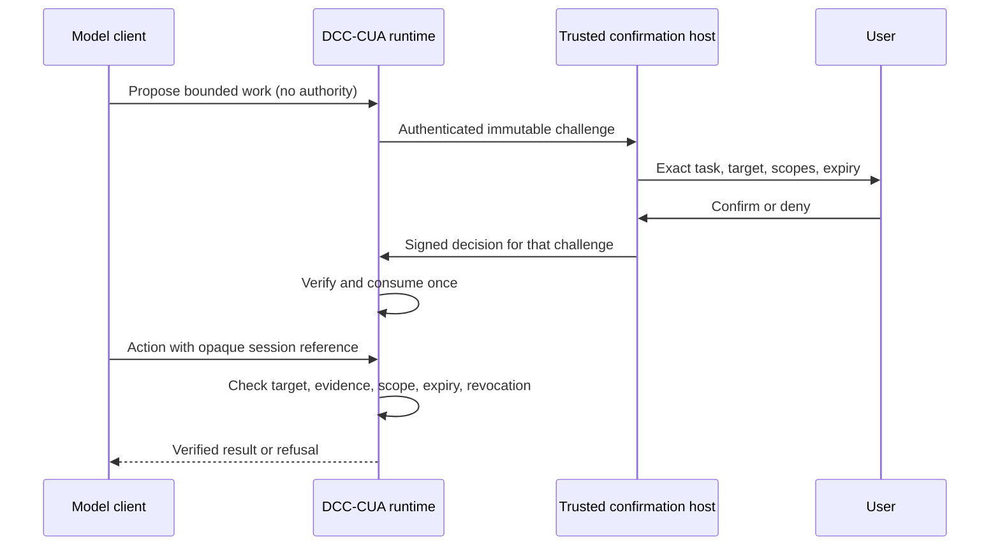

# ADR 0027: Cross-client task authorization

## Status

Proposed. The discovery/fail-closed behavior below is implemented. The signed
receipt protocol, key provisioning, client UI, and runtime verifier are **not
implemented**. No desktop, cloud, or CLI integration is certified by this ADR.
Acceptance requires review and the end-to-end tests below.

Implementation and client acceptance are tracked in
[Issue #237](https://github.com/dcc-mcp/dcc-cua/issues/237).

This revises the process-identity assumption in
[ADR 0026](0026-attest-trusted-desktop-embeddings.md), not the constructor-owned
issuer/validator boundary in [ADR 0024](0024-bridge-trusted-user-input-to-task-authorization.md).

## Problem and evidence

A desktop embedding can launch MCP through an unpackaged signed helper with
neither a package identity nor a version resource. The old bridge refused
startup, so neither the authorization card nor a useful status tool appeared.
An independent Host request then failed parsing `task_grant_id`, masking the
earlier integration failure. The card implementation already existed.

Relaxing executable metadata checks does not solve the trust problem. A process
signature authenticates code, not an individual human decision. MCP clientInfo,
tool visibility metadata, chat text, CLI arguments, environment variables, and
stdio acknowledgements cannot independently prove human presence. A signed
receipt is also insufficient if the model can invoke its signer or choose the
trusted public key.

## Implemented boundary

The packaged `mcp-server` creates no issuer, even when parent attestation
succeeds. It remains discoverable and exposes only the read-only
`authorization_integration_status` tool. Attempted task calls return
`integration_required` without reading proposal scope, creating capabilities,
opening a Host session, launching a browser, or returning a UI resource.

The status document has schema `dcc-cua.authorization-integration.v1` and
reports `authorization_available`, `user_confirmation_available`,
`card_available`, and `process_identity_can_authorize` as false. The next owner
is `client_embedding_integration`. `parent_identity_available` is optional
diagnostic evidence, never permission. Caller-selected client names cannot
change this behavior. Existing constructor-owned, in-process embedding APIs
remain available; their caller owns the real user-input boundary.

## Proposed common protocol

### Trust provisioning

The runtime's trust registry is installed through a constructor-owned service
by the embedding/deployment owner. It binds issuer keys to an authenticated
human-confirmation service and exact client/tenant/user audience. Agent-readable
files, environment variables, command arguments, requests, and self-signed
receipts cannot enroll keys. The signing key and the operation that uses it
must be inaccessible to model-controlled tools, shells, page scripts, and
generic UI automation. An unrestricted local `sign` endpoint is not trusted.

The confirmation host must authenticate the runtime and challenge delivery too;
it must not sign a challenge supplied by a page or substituted by the model.
Key rotation/revocation uses the same independent administrative channel.
This proposal adds no signing secret to the CLI and no bearer-token file.

### Immutable challenge

The runtime generates a cryptographically random nonce and retains the exact
challenge in a bounded, process-local pending registry. Bind all of:

- Protocol version, provider `dcc-cua`, runtime version, runtime instance and
  boot generation, client/tenant/user audience, task ID and connection/session.
- Exact process ID and creation identity, platform-native window identity
  (Windows HWND), and for browser work the Host-observed target ID, tab ID,
  document generation, and canonical HTTP(S) origin.
- Closed Host methods, final action/input kinds, risk categories, secret-handle
  policy, task purpose and any exact irreversible operation being authorized.
- Issuance time, confirmation deadline, task expiry, nonce and challenge ID.

Do not include passwords, tokens, input text, clipboard values, unrelated page
contents, local paths, or cookies. Human labels are bounded data, not authority;
display machine-bound identities and effective scopes too. The UI displays the
exact retained challenge, not a model-written summary. Changed scope or target
requires a new challenge. A title is not a tab ID. A cloud task cannot nominate
local PID/HWND as identity evidence.

Browser setup needs a separate minimal bootstrap authorization when exact tab
identity is not yet observable. It may authorize only fixed exact-window
attachment or a closed isolated-browser launch spec, not DOM read/write,
arbitrary input, uploads, or publication. After deriving the actual browser,
tab and origin, request the final task decision. Do not fabricate a tab ID to
avoid this two-stage boundary.

### Signed decision

Use a closed v2 decision record with schema, issuer key ID, audience, runtime
instance/generation, challenge ID, nonce, SHA-256 challenge digest, decision
(`allow` or `deny`), issuance time and expiry. No receipt-supplied scope can
replace the pending challenge. No receipt supplies a trust root or algorithm.

The proposed algorithm is Ed25519 over the ASCII domain separator
`dcc-cua.task-authorization-receipt.v2`, a NUL byte, and the UTF-8 JCS
serialization of the unsigned decision. Digest the JCS serialization of the
retained challenge. Reject duplicate JSON keys, unknown fields, noncanonical
encodings and out-of-range integers. Use a reviewed library and published test
vectors, not application cryptography. See
[RFC 8032](https://www.rfc-editor.org/rfc/rfc8032.html) and
[RFC 8785](https://www.rfc-editor.org/rfc/rfc8785.html).

Validate issuer trust/revocation, signature, audience and generation bindings,
digest, nonce, deadline and expiry against retained state. Under one lock, a
matching decision consumes the pending challenge at most once. Denial is
terminal too. Verification failure cannot create a task, retry an action,
widen a grant, open a popup, or change provider.

Only successful verification may call the private issuer with the immutable
scope. The model receives an opaque reference, never signing authority. A
receipt may be relayed through an untrusted client, but cannot be minted there.
A valid signature does not prove correct human UI or target-binding integration.

### Lease and revocation

Every call, including observations, rechecks current runtime/connection/target
identity, exact tab/origin, document evidence, method/action/risk scope, expiry
and live revocation epoch. Receipt expiry cannot exceed challenge expiry. Cap
pending confirmations at five minutes and leases at the existing 24-hour
maximum; deployments may require shorter limits.

The trusted UI provides an authenticated, sequence-bound revocation path.
Restart, connection loss, unavailable validation, clock rollback, revoked keys,
target replacement, and stale evidence fail closed. Do not persist reusable
authorizations across runtime generations. Escape/user stops interrupt
immediately and require fresh authorization.

Account verification, CAPTCHA/2FA, payments, agreements, and final irreversible
publication remain separate human boundaries. A broad task lease must not
silently authorize them. Operation-specific confirmation names the exact
effect, target item and artifact/version where applicable.

## Compatibility and next owners

| Client | Current packaged MCP behavior | Required host work |
| --- | --- | --- |
| Codex desktop | Diagnostic only; helper metadata cannot hide status | Protected human UI/signer, independent trust provisioning, authenticated runtime channel; test the actual launch chain |
| Codex cloud | Diagnostic only; no implied local browser access | Authenticated local companion or cloud-owned target, audience-bound confirmation and revocation |
| Codex CLI | Diagnostic only; stdin acknowledgement is untrusted | Independent protected confirmation service inaccessible to the model's shell |
| Cursor | Diagnostic only; client name is not identity | Verified human UI/signing integration and lifecycle tests |
| WorkBuddy | Diagnostic only; signed product identity is not user presence | Verify the deployed product and integrate its real human-input boundary |
| CodeBuddy CLI | Diagnostic only; no inherited desktop trust | Independent confirmation service; do not infer CLI trust from a desktop executable |
| Unknown/noninteractive client | `integration_required` | May relay an independently signed exact challenge only after verifier integration; otherwise stop |
| Trusted in-process embedding | Existing constructor-owned broker API | Keep issuer on authenticated user-input side; never expose registration as a model tool |

DCC-CUA owns challenge types, strict decoding, the verifier adapter, atomic
consumption, exact-target lease enforcement and diagnostics. Client owners own
human presence, signer/key provisioning, trusted display, audience binding and
revocation transport. Cloud/local routing requires both owners. No client
transport has been verified here; enabling one is a separate implementation
and acceptance step.

## Required follow-up tests and rollout

1. Core: published signature/canonicalization vectors; malformed/duplicate
   fields; wrong/unknown/revoked key; forged signature; replay and concurrent
   consumption; substituted runtime/task/audience/PID/HWND/tab/origin; scope or
   expiry widening; clock rollback; restart and lost revocation state.
2. Client isolation: model calls, forged clientInfo/metadata, hostile pages,
   shell/stdio/environment and synthetic UI events cannot sign or enroll
   trust. Cancellation/denial never yields a grant.
3. Real client: show the actual bounded confirmation, obtain genuine human
   input, attest provider/runtime/PID/HWND before observation, verify one scoped
   effect, then revoke and prove the next call is refused.
4. Store workflow: bind a fresh exact tab, verify every transition and upload
   receipt, and stop at the exact required human-only final step. Tests, package
   builds and successful API responses do not prove publication.

Implemented regressions exercise real subprocess MCP handshakes, all six
client labels, absent/recognized parent identity, forged authorization fields,
hidden card resources and no issuer creation. They do not execute the proposed
cryptographic protocol or certify any UI.

## Alternatives and costs

Publisher-only trust, ancestor traversal, caller-supplied keys, magic flags,
ordinary stdin approval and auto-clickable local consent pages are rejected:
none proves an independent human decision. MCP elicitation or Apps may carry
the display, but the host still owns isolation and authentication. See the
[MCP elicitation specification](https://modelcontextprotocol.io/specification/2025-11-25/client/elicitation).

A common receipt permits untrusted relays and avoids per-client policy forks,
but introduces key lifecycle and local/cloud routing costs. Retain the existing
process-local broker; do not add a public authorization daemon, database, or
general signing API in this repair. Review and test integrations and the
verifier before the status can become available.
