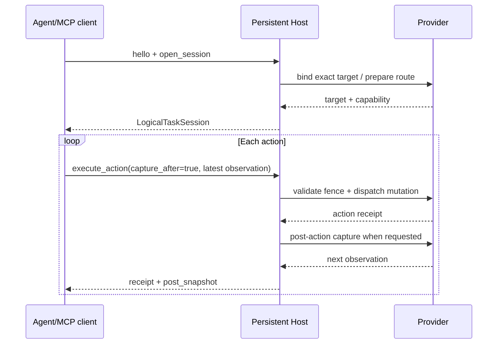

# Codex CUA 与 DCC-CUA 的效率差异分析

## 结论

“Codex CUA 更快”的体感通常不是单一 API 更快，而是端到端路径更短：

1. Codex 更可能复用一个已建立的浏览器/渲染器会话，并把观察、定位和动作合并在一次 provider round-trip 中。
2. DCC-CUA 默认把安全证据当作一等公民：精确 PID/HWND 绑定、最新 observation fence、授权检查、动作后验证，以及在失败时拒绝盲重试。这些是有意的固定成本。
3. DCC-CUA 的通用窗口路径仍可能经过 Host JSONL、Windows UIA worker、截图编码和 JSON 序列化；在可用 CDP/DOM 的浏览器场景中，若路由选择或客户端调用方式不理想，会额外支付不必要成本。

因此优化目标不是删掉安全边界，而是让“同一绑定、同一文档、同一观察证据”在安全约束内被更多复用，并把可观测的等待拆成 provider、transport、serialization、capture、UIA、post-verify 六类。

## 当前实现的事实

- Host 支持持久 JSONL 会话；README 明确建议一个 Host IPC session 承载多步操作，而不是每个 action 启动进程（`crates/dcc-cua-host/src/lib.rs`、README 的 Host IPC 章节）。
- CLI 的单次 `execute_action` 路径在 `crates/dcc-cua-cli/src/actions.rs` 中会创建 driver session、执行 `start()`，获取前置 observation，执行 action，获取后置 observation，执行 `stop()`。它适合一次性命令的隔离语义，不适合拿来代表热 session 的吞吐。
- `dcc-cua-client` 已提供 `LogicalTaskSession`，把 session、task grant、window capability 和 Host connection 绑定在一起。连续动作若没有复用这个对象，会重新支付连接、授权绑定和初次 readiness 成本。
- `execute_action` 可设置 `capture_after`，直接返回 `post_snapshot` 并保留为下一步 observation；如果客户端仍然在每次动作后再次调用 `snapshot`，就会产生重复捕获。
- 语义 action 必须携带最新 `accessibility_state_id`；这是防 stale-reference 的安全契约，但 UIA 快照过大时会成为明显瓶颈。
- 浏览器默认应走 typed CDP，只有 CDP 不可用才走 extension；`crates/dcc-cua-browser` 已维护 tab snapshot、origin 和 epoch 绑定。浏览器 extension 还已有 per-document bridge injection cache。
- Host 已支持 `shared_memory` image transport，但只有客户端协商并持续读取 descriptor 时才能避免 PNG/JSON 管道开销。
- Windows UIA worker、capture worker 与 Host request handler 是多层异步/线程边界；超时、恢复和取消逻辑优先保证不发生盲重试，不能通过简单提高并发来“优化”。

## 可验证的性能假设

按优先级建立基准，而不是用主观体感比较：

| 假设 | 证据/指标 | 低风险优化 |
| --- | --- | --- |
| 每步被客户端重复 snapshot | request trace 中 `action -> snapshot` 成对出现 | 优先消费 `post_snapshot`；客户端状态机禁止无条件二次 snapshot |
| 进程/连接启动占比高 | 首次请求与同 session 第 N 次请求的 p50/p95 | 强制复用 Host 和 logical task session；连接池按目标绑定隔离 |
| 浏览器错误地走 UIA/像素 | provider route、capture mode、CDP availability | CDP-first 路由；route 选择失败时返回明确原因，不静默降级 |
| UIA 树/JSON 太大 | node count、encoded bytes、capture/serialize duration | 目标祖先子树、低默认 node/depth、`accessibility_find`；只在需要语义时请求 UIA |
| 图像编码/复制占比高 | capture duration、PNG bytes、shared-memory hit rate | 协商 shared memory；缓存最新 frame，仅在 frame generation 变化时编码 |
| post-action delay 过长 | requested vs effective delay、verification latency | 只对有动画/异步状态的动作设置 delay；默认 0，按 profile 声明 transition wait |

## 推荐实施顺序

### P0：先把路径测清楚

项目已经有 `host-jsonl --metrics-output`，可统计 action/observation 数量、JSON 字节数和图像字节数，但它记录的是请求级汇总，不足以解释单次延迟。补充内部 timing（默认不暴露敏感内容）：
`provider_ms`, `capture_ms`, `uia_ms`, `action_ms`, `verify_ms`, `serialize_ms`, `transport_ms`，并记录 `request_id`、session、route、node_count、image_bytes、cache_hit。提供本地 trace 导出和 p50/p95/p99 汇总。没有这一步，不应声称 Codex 或 DCC-CUA 更快。

基准必须至少分成两条路径：

| 基准 | 操作序列 | 用途 |
| --- | --- | --- |
| CLI 冷路径 | 每个动作单独 `start → observe → act → observe → stop` | 衡量一次性命令的启动与清理成本 |
| Host 热路径 | 一个连接和 `LogicalTaskSession` 内重复 `observe → act(capture_after) → consume post_snapshot` | 衡量产品集成实际可以达到的连续操作延迟 |

浏览器还要把 CDP、extension 和 exact-window fallback 分开测量；不能把 provider 切换后的结果混成一个平均数。

### P1：客户端/协议去重复

- 将 `post_snapshot` 作为正式的 next-observation 候选；只有 `observation_required=true` 或证据不匹配才重新 snapshot。
- 为连续语义动作增加批量/transaction 请求：每一步都消费前一步的 action-completion receipt 和新发布的 observation epoch，再绑定下一步的 `observation_id`/`accessibility_state_id`；Host 必须在每一步重新验证 exact target 与 epoch，任一步失败就中止批次，同时沿用 observation publication path 的 action-completion 与 transition-fence sequence。若客户端无法提供这种链式状态，批处理范围限制为不会使语义引用失效的动作。
- 在同一 logical session 内复用 browser tab binding、CDP connection 和 semantic snapshot；导航、窗口变化、epoch 变化时精确失效。

### P1：让默认调用走热路径

- 面向 Agent/MCP 集成提供一个长期持有的 task client；不要让上层为每个动作调用一次 CLI `execute_action`。
- 如果必须保留 CLI，增加显式的 session batch/JSONL 模式，让多个请求共享一个已经协商的 Host connection 和 logical task session，并在批次结束时统一 stop。
- 在文档和示例中同时给出冷路径与热路径，避免使用一次性 CLI 的数字评估 Host 或 provider 的真实性能。

`HostClient::request_batch` 当前只允许 read-only Host methods；这是正确的副作用边界，但也解释了为什么连续 mutating action 仍然需要逐个往返。后续若增加动作批处理，应新增显式的顺序执行协议，逐步返回 action receipt 和新的 observation epoch，不能把普通 read-only batch 约束放宽成并发 mutation。

## 一条可落地的热路径

这条路径把连接、授权和目标绑定成本摊到整个任务，并把动作后的观察直接交给下一步。它仍然保留每次动作的 observation fence；减少的是重复工作，不是证据要求。

### P1：路由与观察分层

- 浏览器：CDP/DOM → extension → exact-window UIA/visual，路由结果可见且不可静默切换。
- 原生应用：把 `full` snapshot 拆成轻量 state probe、按需 accessibility subtree、按需 pixels；动作前只取满足该 action safety tier 的最小证据。
- 对可声明的 profile 增加 `transition_wait`/`stable_state`，避免所有动作都使用统一保守等待。

### P2：减少数据搬运

- shared-memory descriptor 采用 zero-copy reader，避免 Host 内部再次 clone `Value`/PNG。
- semantic snapshot 使用稳定 element token 与增量 patch（仅在协议兼容且可验证 stale 时启用）；patch 丢失则回退完整快照。
- 将大树结果分页/ancestor-scoped，默认只返回 action-relevant subtree。

### P2：并发边界

只并发 read-only、不同目标或独立 session；同一 exact target 的 mutating action 继续串行。为 UIA worker、capture 与 browser provider 设置独立 bounded semaphore，防止高并发把 p95 变成全局排队。

## 不应采用的“优化”

- 删除 PID/HWND、snapshot fence、授权或 post-action verification。
- 让 stale semantic element 自动重试到“看起来成功”。
- 用全局缓存跨 session/目标共享 observation、tab ref 或授权。
- 通过静默 UIA/坐标降级掩盖 CDP/provider 故障。
- 仅以工具调用数、无 host 的 mock benchmark 或“输入已发送”作为成功/性能证据。

## 建议的验收矩阵

固定同一机器、同一目标、同一动作脚本，对 Codex-like baseline 与 DCC-CUA 分别跑冷启动/热 session、浏览器 CDP、浏览器 extension、Windows UIA、pixels-only 五组；报告 p50/p95/p99、成功率、重复 snapshot 数、post-verification 延迟、图像字节数和安全拒绝数。任何优化必须保持 stale-reference、目标变更、provider 失败和 action-executed-but-post-capture-failed 的现有错误契约。
