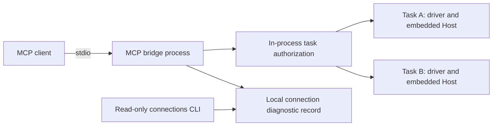

# MCP connection diagnostics and lifecycle review

Status: diagnostic implementation candidate; shared-Host migration is a proposal.

## Problem and requirements

A count of `dcc-cua mcp-server` processes cannot establish a leak. A client can
keep an idle stdio connection valid, and closing a chat view does not itself
prove that the client closed its pipe. Operators need to identify each bridge,
the client identity it actually received, its build, and its connection state.

The diagnostic contract must be read-only, bounded, independent of task
authorization, and useful without UI calls. It must not expose credentials,
task parameters, window contents, command lines, environment variables, or
authorization receipts. Registry failures must not prevent a working MCP
connection from serving requests. Unknown identity must remain unknown.

## Current architecture and lifecycle

The current stdio MCP server owns a `TaskAuthorizationServer`. Each started
task creates its own driver and an embedded Host over a Tokio duplex stream in
`open_task_session`; it does not connect that task to the default external Host.
The task authorization broker and its grants remain inside the MCP process.
An independently running `dcc-cua host` therefore does not establish that MCP
bridges share execution resources.



The baseline lifecycle has these boundaries:

- The idle MCP read loop exits on stdin EOF. Input, output, and frame-limit
  errors also return from the server. Stdout contains protocol messages only.
- There is no parent-process death watcher. Normal parent exit generally closes
  its pipe handles; retained or duplicated writers can prevent EOF. Parent PID
  alone cannot establish the pipe holder or a chat's ownership.
- Requests are handled sequentially. An awaited tool call delays reading EOF
  and later notifications; notifications, including cancellation, are currently
  ignored. Idle-EOF success does not certify disconnect during a hung call.
- Embedded Host connection finalization joins its discovery tasks and awaits
  best-effort stop attempts for its owned sessions; stop errors are not an
  attestation of native resource cleanup. The MCP task creator discards the embedded Host's join
  handle, so MCP teardown and `stop_task` do not await proof of that cleanup.
- A stopped or expired proposal can remain in the bounded proposal collection.
  A stored task session is not a live Host health probe. Task counts describe
  local task bookkeeping rather than application readiness.

See `crates/dcc-cua-cli/src/mcp_server.rs`,
`crates/dcc-cua-host/src/lib.rs`, and
`crates/dcc-cua-host/src/session_state.rs` for the ownership paths. These findings
identify follow-up work; this change does not replace transport ownership,
implement cancellation, or join embedded Host shutdown.

## ADR: observe connections before changing ownership

**Decision.** Keep the current transport and authorization boundaries. Add one
diagnostic record per MCP stdio connection, a local read-only CLI query, and an
MCP resource limited to the caller's current connection. Do not kill bridges
based on idle duration, process count, or an inferred chat state.

**Alternatives.** Reusing a single stdin/stdout pair across unrelated clients
would erase transport ownership. Moving every task to the existing external
Host would cross the current in-process trust boundary without transporting
authenticated, connection-scoped grants. A full HTTP service is a larger change
and would not serve clients that support only stdio.

**Consequences.** New instrumented bridges become attributable by stable
connection and process identities. Old resident builds remain unknown. The
registry is an observation aid, not a service broker, credential store, or
cleanup authority. Local diagnostics do not certify a client's private chat
lifecycle.

The MCP specification defines stdio as a client-launched subprocess with a
private stdin/stdout channel, while Streamable HTTP permits an independent
server serving multiple clients. It defines connection shutdown through the
transport; it does not define a chat-close event. See the official
[transport](https://modelcontextprotocol.io/specification/2025-11-25/basic/transports)
and [lifecycle](https://modelcontextprotocol.io/specification/2025-11-25/basic/lifecycle)
specifications.

## Public diagnostic contract

`dcc-cua connections` returns a `dcc-cua.connections.v1` report. Each record has
schema `dcc-cua.connection.v1`.

| Field | Meaning and limit |
| --- | --- |
| `connection_id`, `transport` | Random connection identity and `stdio`; independent of task or chat identity. |
| `bridge`, `parent` | PID, optional creation time, and an OS creation identity used to detect PID reuse; missing identity remains unknown. |
| `runtime` | Compiled runtime version, optional source revision and dirty flag, build profile, and target. The executable now installed at an old path cannot identify an already running bridge. |
| `created_at_unix_ms`, `last_activity_at_unix_ms` | Bridge startup and last observed protocol activity; no activity does not imply disconnection. |
| `request_in_flight` | Whether request handling was last observed in progress; not a thread stack or live task health probe. |
| `initialized_at_unix_ms`, `closed_at_unix_ms` | Observed milestones; inferred process exit has no invented exact close time. |
| `state`, `process_status` | Connection bookkeeping (`connected`, `initialized`, `closed`) and independently queried process status (`live`, `ended`, `unknown`). |
| `close_reason`, `close_reason_source` | Observed termination path or an explicitly inferred process exit. They do not infer stdin EOF from process absence. |
| `client_info` | Allowlisted, bounded `initialize.params.clientInfo.name` and `version`; other client fields are discarded. |
| `client_metadata` | Optional explicitly supplied chat/task identifiers with `client_supplied` provenance, otherwise null with `unknown` provenance. |
| `tasks` | Last observed bounded local pending/active/stopped/expired bookkeeping; not a health or cleanup assertion. |
| `associated_hosts` | Last observed actual task Host associations, retained at close. Current task Hosts are embedded in the bridge process; do not substitute the external default Host or infer completed cleanup from the close record. |
| `registry_available` | Whether diagnostic publication/query was available; failure does not block MCP. |

For explicit correlation, a client may add the following optional initialization
metadata. Identifiers are bounded opaque labels, not trusted authorization:

```json
{
  "clientInfo": {"name": "ExampleClient", "version": "1.0.0"},
  "_meta": {"dcc-cua": {"chat_id": "chat-123", "task_id": "task-456"}}
}
```

The server does not derive chat IDs from parent processes, window titles,
command lines, chat databases, or client internals. A client-supplied value can
be inaccurate; provenance remains explicit.

### CLI and MCP access

```powershell
# Query records written by instrumented MCP bridges for this local user.
dcc-cua connections

# Use one dedicated directory for both a test bridge and its query.
dcc-cua mcp-server --diagnostics-dir C:\Temp\dcc-cua-diagnostics
dcc-cua connections --diagnostics-dir C:\Temp\dcc-cua-diagnostics
```

The `mcp-server` command must be launched by an MCP client that owns its stdio
pipes. The example does not attach to or restart existing bridges.

The default registry is `%LOCALAPPDATA%\dcc-cua\connections` on Windows,
`$XDG_STATE_HOME/dcc-cua/connections` on Unix when set to an absolute path, or
`$HOME/.local/state/dcc-cua/connections` otherwise. `--diagnostics-dir` must be
an absolute path and is the explicit override; there is no separate diagnostic
environment override. A missing directory produces `registry_available: false`
without creating it during a query. The current MCP resource remains readable
from memory when publication is unavailable.

MCP `resources/list` advertises `dcc-cua://connection/current`; `resources/read`
returns only that server connection's in-memory record. An MCP caller cannot
enumerate other connections through this resource. The local `connections`
command reads the registry without starting a Host, requesting a task grant,
changing processes, or cleaning records.

Reports scan at most 1,024 directory entries, accept at most 64 KiB per record,
return at most 256 records, and tolerate unreadable or malformed records. A
writer retains the newest 128 terminal records; a record with unknown process
status is not treated as an ended process for deletion. Terminal history is
bounded during bridge publication, not during the read-only query.
`scan_truncated` indicates incomplete directory enumeration. Windows uses
FILETIME and Linux uses boot ID plus start ticks for PID reuse detection; the
current macOS implementation reports unknown creation identity and process
status. The registry is
local diagnostic data, not a cryptographically authenticated client inventory.

## Future shared execution architecture

A shared execution Host with one light bridge per stdio connection remains a
reasonable direction within one OS user, interactive desktop/session, and
compatible runtime and permission configuration. It can reduce duplicate driver
resources and provide one place to arbitrate native input. A process-local input
queue cannot serialize input across separate bridge processes today.

Before migration, define authenticated IPC for scoped grants, connection-owned
leases, per-client namespaces, exact target and observation fencing, disconnect
revocation, broker generation, and ownership of Host startup/shutdown. Sharing
must not let one client revoke another client's tasks or widen its authority.

| Failure mode | Required behavior before migration |
| --- | --- |
| Idle valid client | Preserve connection; task lease expiry is a separate policy. |
| EOF or client death | Revoke and join only that connection's owned work; distinguish retained pipe writers. |
| In-flight request or cancellation | Read transport events concurrently and stop bounded owned work; test with injected operations. |
| Host crash/restart | Invalidate old grants/capabilities by generation; require fresh authorization and observation; no blind replay. |
| PID reuse or runtime upgrade | Match OS creation identity and compiled build identity; tolerate old, uninstrumented processes as unknown. |
| Multiple users/desktops/configurations | Use separate compatible service scopes rather than one machine-global Host. |
| HTTP clients | Add a shared authenticated Streamable HTTP endpoint only for supported clients, with Origin checks, localhost binding, and isolated sessions. |

Shared Host and HTTP support are not implemented by this diagnostic change.

## Validation scope

Required candidate checks cover metadata minimization, unknown correlation,
process-identity comparison, unavailable or malformed registries, bounded
terminal retention, concurrent independent bridges, current-connection resource
isolation, EOF before/after initialization, malformed/oversized input, and
protocol-clean stdout. Candidate test and CI results must be recorded against
the final source revision before delivery.

Separately required lifecycle work includes disconnect during an in-flight
operation, cancellation, joined embedded Host teardown, and shared Host restart
behavior. A passing idle EOF probe is not evidence for those cases. Published
artifacts and installed-client acceptance remain separate from source tests.
